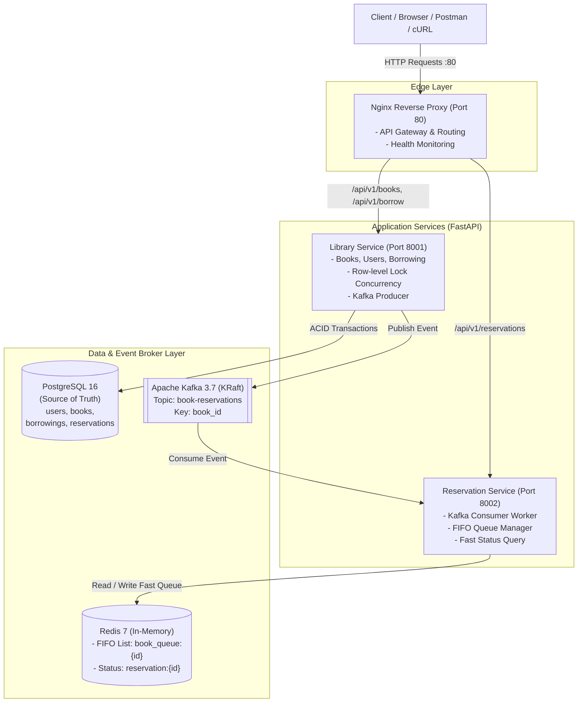
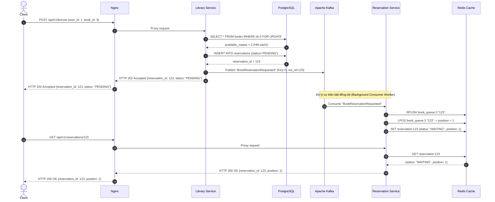
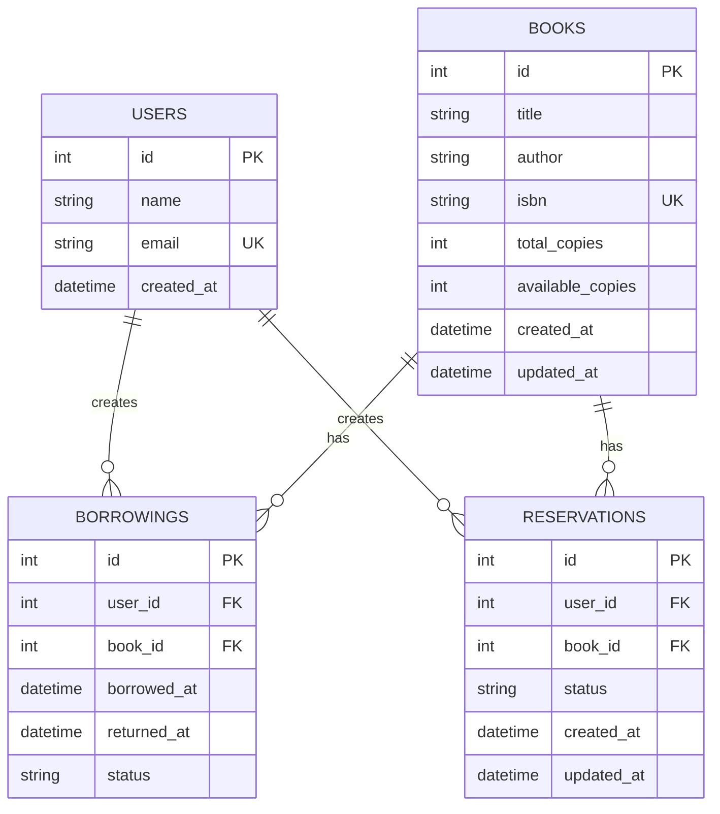

# Smart Library – Asynchronous Book Reservation System

[](https://github.com)


> Mini-system phục vụ bài tập lớn **Internship Week 4** với chủ đề: **Smart Library – Asynchronous Book Reservation System**.  
> Hệ thống áp dụng kiến trúc Microservices tinh gọn kết hợp luồng xử lý sự kiện bất đồng bộ thực sự qua **Apache Kafka**, lưu trữ bền vững trên **PostgreSQL**, quản lý hàng đợi FIFO và tra cứu trạng thái siêu tốc qua **Redis**, đứng sau cổng vào duy nhất là **Nginx Reverse Proxy**.

---

## 1. Kiến trúc hệ thống tổng thể (System Architecture)

Hệ thống bao gồm 6 containers được điều phối tự động qua **Docker Compose**:



---

## 2. Luồng nghiệp vụ & Sequence Diagram (Business Flow)

### 2.1. Quy tắc nghiệp vụ
1. **Sách còn (`available_copies > 0`)**: Xử lý đồng bộ (Synchronous). Trừ số lượng sách nguyên tử trong PostgreSQL bằng Row-level Lock (`SELECT ... FOR UPDATE`), tạo bản ghi `Borrowing` (`BORROWED`) và trả về `HTTP 200 OK`.
2. **Sách hết (`available_copies == 0`)**: Xử lý bất đồng bộ (Asynchronous).
   * `Library Service` tạo bản ghi `Reservation` (`PENDING`) trong PostgreSQL.
   * Publish event `BookReservationRequested` vào Kafka với partition key là `book_id` và trả về ngay `HTTP 202 Accepted` cho Client.
   * `Reservation Service` consume event ở chế độ background worker, đẩy user vào hàng đợi FIFO `book_queue:{book_id}` trong Redis và cập nhật `position`.
   * Client tra cứu trạng thái và vị trí hàng đợi tức thì qua `GET /api/v1/reservations/{id}` từ RAM Redis (< 2ms).



---

## 3. Thiết kế Cơ sở Dữ liệu & Cấu trúc Dữ liệu

### 3.1. Entity Relationship Diagram (PostgreSQL)



* **Kiểm soát tranh chấp (Concurrency Control)**: Sử dụng **Pessimistic Row-Level Lock**:
  ```python
  stmt = select(Book).where(Book.id == book_id).with_for_update()
  ```
  Ngăn chặn triệt để Race Condition khi 2 user cùng mượn 1 cuốn sách cuối cùng tại cùng 1 thời điểm. Số lượng sách không bao giờ bị âm.

### 3.2. Cấu trúc Hàng đợi trong Redis (In-Memory)
* **FIFO Queue**: `book_queue:{book_id}` dạng **Redis List**:
  * Thêm vào cuối hàng: `RPUSH book_queue:{book_id} {reservation_id}`.
  * Lấy số thứ tự: `LPOS book_queue:{book_id} {reservation_id} + 1`.
  * Tự động tịnh tiến khi người phía trước được phục vụ (`LPOP`).
* **Fast Status Cache**: `reservation:{reservation_id}` dạng **Redis String (JSON)** lưu thông tin chi tiết và phục vụ truy vấn dưới 2ms.

### 3.3. Kafka Event Contract
* **Topic**: `book-reservations`
* **Partition Key**: `str(book_id)` *(Đảm bảo các yêu cầu của cùng cuốn sách luôn vào cùng 1 partition để bảo toàn tính thứ tự FIFO)*.
* **Payload**:
  ```json
  {
    "event_id": "c62b6623-8c4d-44eb-a548-cfae090df4b9",
    "event_type": "BookReservationRequested",
    "timestamp": "2026-09-14T01:00:00.000000Z",
    "data": {
      "reservation_id": 123,
      "user_id": 101,
      "book_id": 25
    }
  }
  ```

---

## 4. Danh mục API Endpoints (Qua Nginx Port 80)

| Phương thức | Đường dẫn API | Service xử lý | Mô tả |
| :--- | :--- | :--- | :--- |
| `GET` | `/health` | Nginx Gateway | Trạng thái tổng quan của API Gateway |
| `GET` | `/health/library` | Library Service | Deep Health Check: PostgreSQL ping (ms) + Kafka Producer |
| `GET` | `/health/reservation` | Reservation Service | Deep Health Check: Redis ping (ms) + Kafka Consumer |
| `GET` | `/api/v1/books` | Library Service | Danh sách sách trong thư viện |
| `GET` | `/api/v1/books/{id}` | Library Service | Chi tiết sách theo ID |
| `POST` | `/api/v1/books` | Library Service | Thêm sách mới vào hệ thống |
| `POST` | `/api/v1/borrow` | Library Service | Mượn sách (`200 OK` nếu còn, `202 Accepted` nếu hết) |
| `GET` | `/api/v1/reservations/{id}`| Reservation Service | Tra cứu nhanh vị trí và trạng thái hàng đợi từ Redis |

---

## 5. Hướng dẫn cài đặt và khởi chạy (Quick Start)

### 5.1. Yêu cầu hệ thống
* [Docker](https://docs.docker.com/get-docker/) và [Docker Compose](https://docs.docker.com/compose/)
* Python 3.12+ (nếu chạy test local)

### 5.2. Khởi chạy toàn bộ hệ thống bằng 1 lệnh
```bash
# 1. Clone repository
git clone https://github.com/<your-username>/smart-library-reservation.git
cd smart-library-reservation

# 2. Khởi tạo môi trường (nếu cần chỉnh sửa cấu hình)
cp .env.example .env

# 3. Build và khởi động 6 containers
docker compose up --build -d
```

Docker Compose sẽ tự động:
1. Khởi động `postgres`, `redis`, `kafka` (KRaft mode).
2. Chạy migration Alembic (`alembic upgrade head`) tạo 4 bảng.
3. Nạp dữ liệu mẫu (`seed data`): 3 người dùng và 3 cuốn sách.
4. Bật 2 FastAPI services và Nginx Reverse Proxy.

Kiểm tra trạng thái các container:
```bash
docker compose ps
```

---

## 6. Trình diễn Demo trực tiếp (Live Demo)

Dự án đã tích hợp sẵn script tự động kịch bản demo:

```bash
chmod +x scripts/demo.sh
./scripts/demo.sh
```

**Kịch bản demo bao gồm:**
1. **Kiểm tra sức khỏe**: Kiểm tra Nginx, đo ping PostgreSQL (ms) và Redis (ms).
2. **Xem kho sách**: Cuốn số 3 (*The Pragmatic Programmer*) có số lượng khả dụng là 0.
3. **Mượn thành công (Synchronous)**: User 1 mượn sách số 1 $\rightarrow$ `HTTP 200 BORROWED`.
4. **Hết sách (Asynchronous #1)**: User 1 mượn sách số 3 $\rightarrow$ `HTTP 202 RESERVATION_CREATED`, tạo reservation ID=1.
5. **Hết sách (Asynchronous #2)**: User 2 mượn sách số 3 $\rightarrow$ `HTTP 202 RESERVATION_CREATED`, tạo reservation ID=2.
6. **Tra cứu Redis**:
   * User 1 có `status: WAITING, position: 1`.
   * User 2 có `status: WAITING, position: 2`.
7. **Truy vết Log phân tán**: Hiển thị `trace_id` đồng nhất truyền từ HTTP Request qua Kafka sang Redis Consumer.

---

## 7. Kiểm thử tự động & Đo độ bao phủ (Testing & Coverage)

Hệ thống sở hữu bộ test gồm **25 test cases** bao phủ Unit, Integration, Concurrency, Kafka Async và Edge cases:

```bash
# 1. Kích hoạt môi trường ảo
source .venv/bin/activate

# 2. Chạy toàn bộ test cases và xuất báo cáo coverage
PYTHONPATH=. pytest -v --cov=services/ --cov-report=term-missing tests/
```

*Kết quả*: **25/25 test cases PASS (0.45s)**, các module nghiệp vụ cốt lõi đạt **96% - 100% coverage**.

---

## 8. CI/CD Pipeline (GitHub Actions)

Quy trình CI/CD được thiết lập tại [`.github/workflows/ci.yml`](.github/workflows/ci.yml) tự động kích hoạt mỗi khi `push` hoặc `pull_request` vào `main`:
1. **Job 1 (`test`)**: Cài đặt môi trường Python 3.12, nạp cache pip, thực thi 25 bài test tự động và đo độ bao phủ.
2. **Job 2 (`build-docker`)**: Xác thực file `docker-compose.yml` và build độc lập cả 3 Docker images (`library-service`, `reservation-service`, `nginx`).

---

## 9. Cấu trúc thư mục dự án

```text
smart-library-reservation/
├── .github/
│   └── workflows/
│       └── ci.yml               # GitHub Actions CI pipeline
├── docker-compose.yml           # Điều phối cụm 6 container
├── .env.example                 # Mẫu biến môi trường
├── .gitignore                   # Loại trừ file tạm, cache, venv
├── pytest.ini                   # Cấu hình pytest async
├── README.md                    # Tài liệu hướng dẫn chính
├── nginx/
│   ├── Dockerfile
│   └── nginx.conf               # Cấu hình Reverse Proxy & Upstream
├── scripts/
│   └── demo.sh                  # Script kịch bản demo trực tiếp
├── services/
│   ├── library_service/
│   │   ├── Dockerfile
│   │   ├── requirements.txt
│   │   ├── alembic.ini
│   │   ├── alembic/             # Database migrations
│   │   └── src/
│   │       ├── main.py          # FastAPI app & RequestID middleware
│   │       ├── core/            # Config, DB async engine, logging filter
│   │       ├── models/          # User, Book, Borrowing, Reservation
│   │       ├── schemas/         # Pydantic schemas
│   │       ├── services/        # Row-level lock borrow logic
│   │       ├── api/             # Endpoints (/books, /borrow, /health)
│   │       ├── kafka/           # Kafka Producer client
│   │       └── scripts/seed.py  # Seed initial sample data
│   │
│   └── reservation_service/
│       ├── Dockerfile
│       ├── requirements.txt
│       └── src/
│           ├── main.py          # FastAPI app & lifespan background worker
│           ├── core/            # Config, async Redis client, logging
│           ├── schemas/         # Pydantic schemas
│           ├── services/        # FIFO Queue service via Redis
│           ├── api/             # Endpoints (/reservations/{id}, /health)
│           └── kafka/           # Background Kafka Consumer worker
└── tests/
    ├── conftest.py
    ├── test_library/            # Tests API, Borrow flow, Concurrency
    ├── test_reservation/        # Tests Redis Queue, Dynamic repositioning
    └── test_kafka/              # Tests Kafka Event Contract & Async pipeline
```
