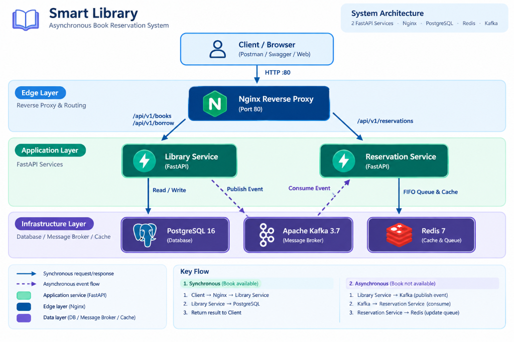
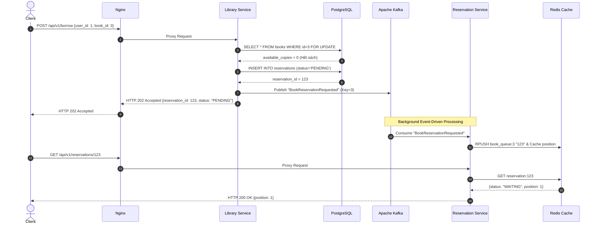

# Smart Library – Asynchronous Book Reservation System

[](https://github.com/TTung815/smart-library-reservation/actions/workflows/ci.yml)


> **Smart Library** là hệ thống quản lý mượn và đặt trước sách (Book Reservation System) theo kiến trúc **Microservices** kết hợp **Event-Driven Architecture**. Hệ thống xử lý mượn sách đồng bộ khi còn hàng và tự động kích hoạt luồng xử lý bất đồng bộ qua **Apache Kafka** cùng hàng đợi FIFO trong **Redis** khi hết hàng, đứng sau một cổng vào duy nhất là **Nginx Reverse Proxy**.

---

## 1. System Architecture (Kiến trúc hệ thống)

Hệ thống bao gồm 6 containers độc lập được điều phối qua **Docker Compose**:



---

## 2. Business Flow & Concurrency Design

### 2.1. Quy tắc xử lý nghiệp vụ (Business Rules)
1. **Sách còn (`available_copies > 0`) $\rightarrow$ Synchronous**:
   * Áp dụng **Pessimistic Row-Level Lock** (`SELECT ... FOR UPDATE`) trong PostgreSQL để bảo đảm tính nguyên tử và chống triệt để Race Condition khi có nhiều người mượn cùng lúc.
   * Giảm số lượng sách, tạo bản ghi `Borrowing` (`BORROWED`) và trả về `HTTP 200 OK`.
2. **Sách hết (`available_copies == 0`) $\rightarrow$ Asynchronous**:
   * Tạo bản ghi `Reservation` trạng thái `PENDING` trong PostgreSQL.
   * Publish event `BookReservationRequested` vào Kafka với partition key là `book_id` và trả về ngay `HTTP 202 Accepted`.
   * Background Consumer Worker của `Reservation Service` consume event từ Kafka, đưa vào hàng đợi FIFO `book_queue:{book_id}` trong Redis (`RPUSH`).
   * Người dùng tra cứu tức thì vị trí hàng đợi qua RAM Redis (`< 2ms`).



---

## 3. Tech Stack Highlights

| Thành phần | Công nghệ | Vai trò kỹ thuật nổi bật |
| :--- | :--- | :--- |
| **API Gateway** | Nginx Reverse Proxy | Cổng vào duy nhất port 80, định tuyến path-based, deep health monitoring. |
| **Library Service** | FastAPI + SQLAlchemy 2.0 | Quản lý sách, mượn sách, Pessimistic Row Lock (`with_for_update`). |
| **Reservation Service** | FastAPI + `redis.asyncio` | Background Consumer Worker, quản lý hàng đợi FIFO trên Redis RAM. |
| **Event Broker** | Apache Kafka 3.7 (KRaft) | Message broker bất đồng bộ, phân vùng partition theo `book_id` bảo toàn thứ tự FIFO. |
| **Database** | PostgreSQL 16 | ACID Database lưu trữ dữ liệu bền vững (Source of Truth), Alembic migrations. |
| **Cache & Queue** | Redis 7 | Redis List (`RPUSH`/`LPOS`) làm hàng đợi chờ, phản hồi tra cứu latency cực thấp (< 2ms). |
| **Observability** | Correlation ID (`X-Request-ID`)| Tự động sinh hoặc kế thừa Trace ID qua HTTP header, inject vào toàn bộ log hệ thống. |

---

## 4. Quick Start (Khởi chạy nhanh)

### Yêu cầu
* Đã cài đặt [Docker](https://docs.docker.com/get-docker/) và Docker Compose v2.

### Chạy toàn bộ hệ thống bằng 1 câu lệnh:
```bash
# 1. Clone repository
git clone https://github.com/TTung815/smart-library-reservation.git
cd smart-library-reservation

# 2. Khởi động 6 containers (tự động migration và nạp seed data mẫu)
docker compose up --build -d
```

Kiểm tra trạng thái các service:
```bash
docker compose ps
```

---

## 5. Live Demo Script

Dự án đi kèm kịch bản tự động kiểm thử toàn bộ luồng hệ thống từ đầu đến cuối:

```bash
chmod +x scripts/demo.sh
./scripts/demo.sh
```

**Kịch bản demo tự động thực hiện:**
1. **Deep Health Check**: Đo latency phản hồi của PostgreSQL và Redis (ms).
2. **Mượn thành công**: Sách còn $\rightarrow$ trả về `HTTP 200 BORROWED`.
3. **Mượn khi hết sách**: Sách hết $\rightarrow$ chuyển sang luồng Kafka async, trả về `HTTP 202 ACCEPTED`.
4. **Hàng đợi Redis FIFO**: User 1 vào vị trí số 1 (`position: 1`), User 2 vào vị trí số 2 (`position: 2`).
5. **Truy vết Log (Distributed Tracing)**: Trích xuất log cho thấy `trace_id` đồng nhất từ Nginx sang Library Service, Kafka và Reservation Service.

---

## 6. API Endpoints (Qua Nginx Port 80)

| Method | Endpoint | Target Service | Mô tả |
| :--- | :--- | :--- | :--- |
| `GET` | `/health` | Nginx Gateway | Trạng thái tổng quan của Gateway |
| `GET` | `/health/library` | Library Service | Deep Health Check (ping PostgreSQL + Kafka status) |
| `GET` | `/health/reservation` | Reservation Service | Deep Health Check (ping Redis + Kafka Consumer status) |
| `GET` | `/api/v1/books` | Library Service | Lấy danh sách tất cả sách |
| `GET` | `/api/v1/books/{id}` | Library Service | Lấy chi tiết sách theo ID |
| `POST` | `/api/v1/borrow` | Library Service | Mượn sách (`200 OK` hoặc `202 Accepted`) |
| `GET` | `/api/v1/reservations/{id}` | Reservation Service | Tra cứu vị trí hàng đợi và trạng thái từ Redis |

---

## 7. Testing & CI/CD Pipeline

* **Automated Tests**: 25 bài test bao phủ Unit, Integration, Concurrency, Kafka Async và Redis Queue:
  ```bash
  source .venv/bin/activate
  PYTHONPATH=. pytest -v --cov=services/ --cov-report=term-missing tests/
  ```
  *(100% tests PASS trong 0.45s, coverage đạt 83% toàn dự án và 96-100% các module nghiệp vụ).*

* **GitHub Actions**: Tự động chạy toàn bộ test suite, đo coverage và validate Docker build mỗi khi `push` lên branch `main`.

---

## 8. Cấu trúc thư mục dự án

```text
smart-library-reservation/
├── .github/workflows/ci.yml       # GitHub Actions CI pipeline
├── docker-compose.yml             # Orchestration 6 containers
├── nginx/
│   ├── Dockerfile
│   └── nginx.conf                 # Cấu hình Reverse Proxy & Upstream routing
├── scripts/
│   └── demo.sh                    # Automated Live Demo script
├── services/
│   ├── library_service/           # FastAPI Book & Borrowing Service (Postgres + Kafka Producer)
│   │   ├── alembic/               # Database migrations
│   │   └── src/                   # Source code & row-level lock logic
│   └── reservation_service/       # FastAPI Reservation Service (Kafka Consumer + Redis FIFO)
│       └── src/                   # Source code & in-memory queue logic
└── tests/                         # 25 automated test cases (API, Concurrency, Kafka, Redis)
```
